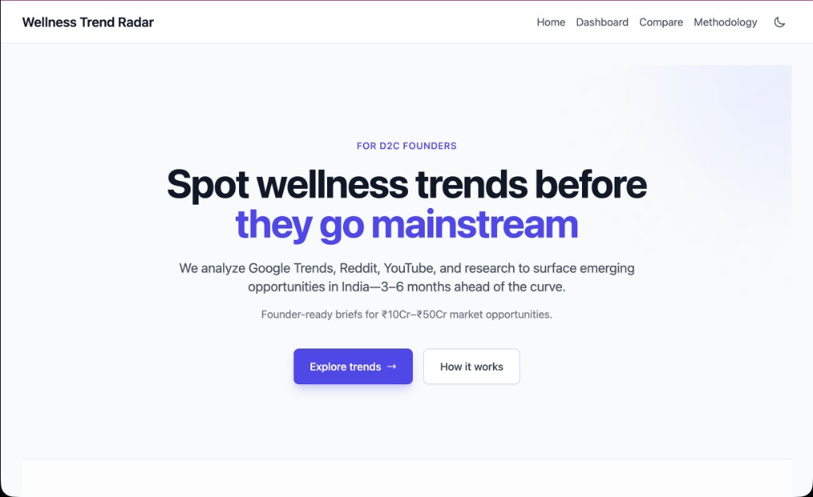
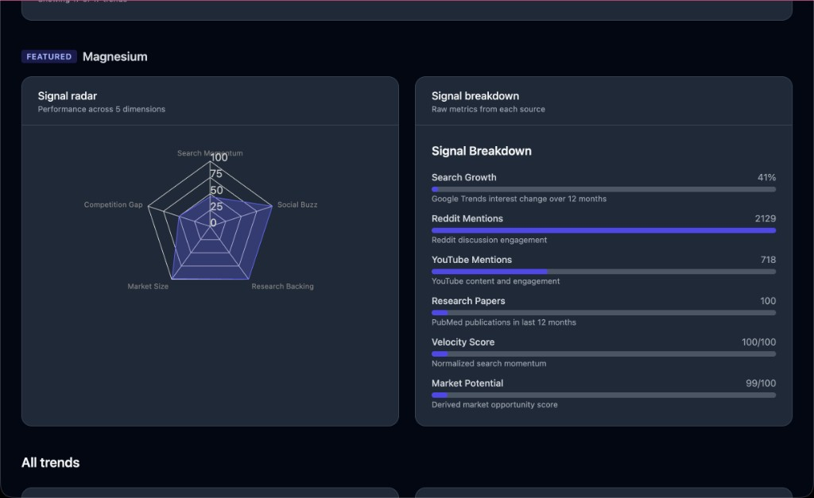
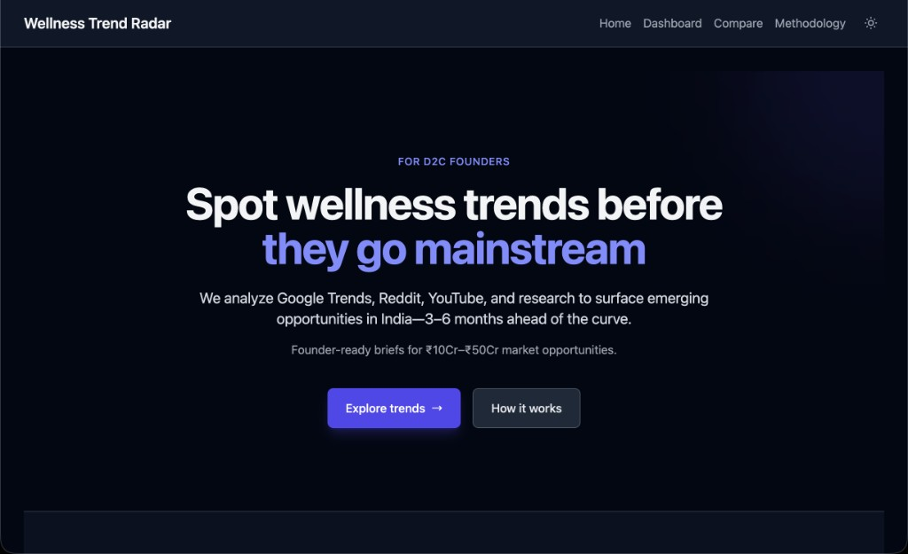
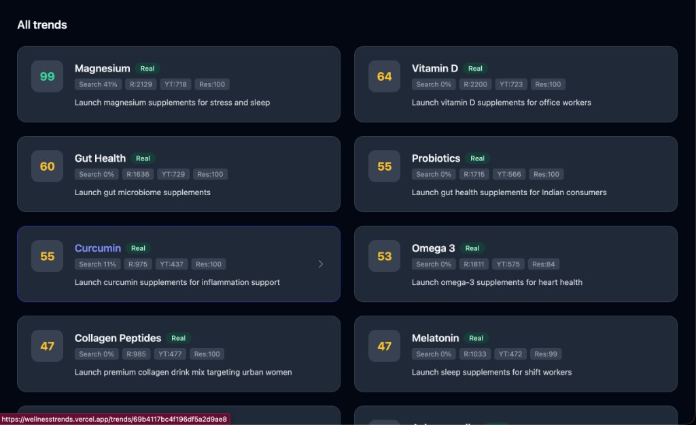
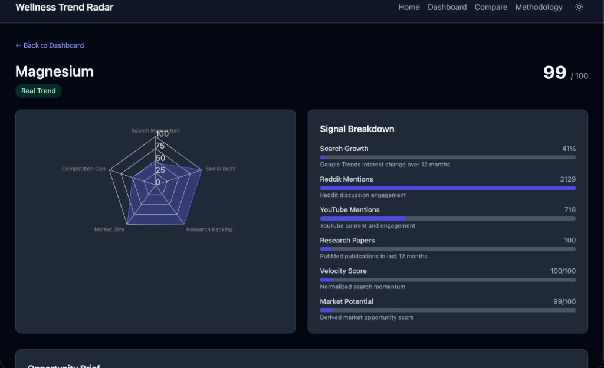
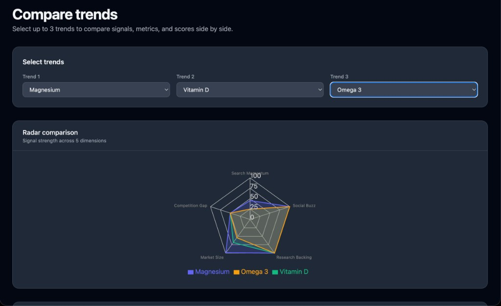
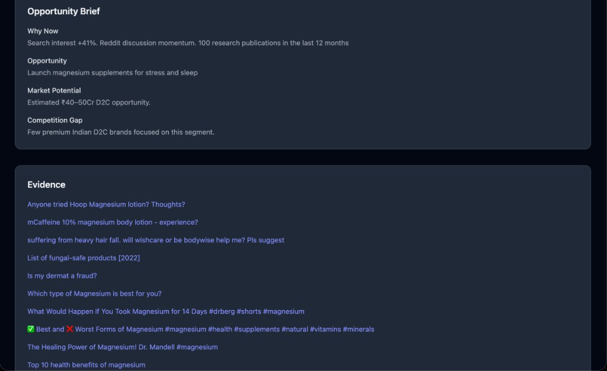
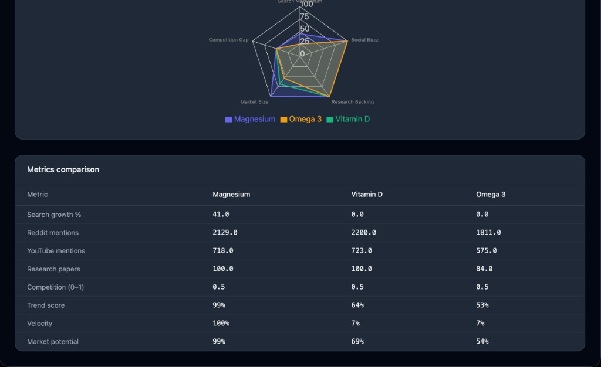
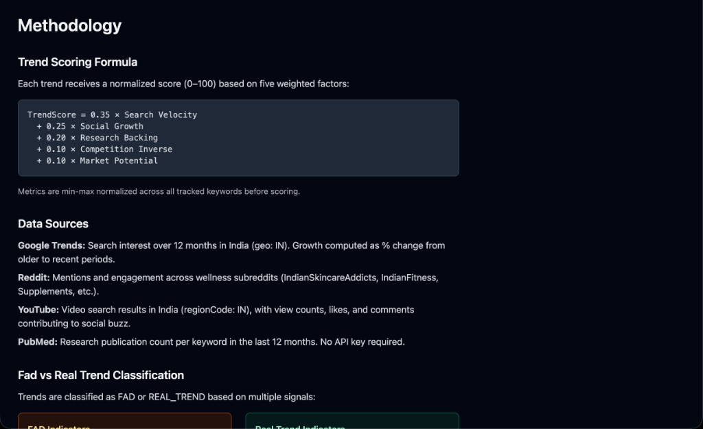

# Wellness Trend Radar India

A MERN application that detects emerging wellness trends in India 3–6 months before mainstream adoption by analyzing signals from Google Trends, Reddit, YouTube, and PubMed. Produces founder-ready opportunity briefs for D2C market opportunities in the ₹10Cr–₹50Cr range.

**Live Demo:** [https://wellnesstrends.vercel.app/](https://wellnesstrends.vercel.app/)

## Screenshots

| Home | Dashboard |
|------|-----------|
|  |  |
|  |  |

| Trend Detail | Compare Trends |
|--------------|----------------|
|  |  |
|  |  |

| Methodology |
|-------------|
|  |

## System Design

The application follows a data pipeline architecture: **collectSignals → extractKeywords → calculateMetrics → scoreTrends → detectFads → generateOpportunityBrief → storeTrends**. Data is collected from four APIs (Google Trends, Reddit JSON API, YouTube Data API v3, PubMed E-utilities), merged by keyword, and normalized. Each trend receives a composite score from five weighted factors: Search Velocity (35%), Social Growth (25%), Research Backing (20%), Competition Inverse (10%), and Market Potential (10%). A fad classifier distinguishes short-lived spikes from sustained multi-platform trends. The pipeline runs automatically every 24 hours via node-cron; results are cached for 24 hours to minimize DB load. The frontend serves a Linear/Notion-style dashboard with trend cards, radar charts, and opportunity briefs.

## Tech Stack

- **Frontend:** React, Vite, TailwindCSS, Recharts
- **Backend:** Node.js, Express
- **Database:** MongoDB
- **APIs:** google-trends-api, Reddit (public JSON), YouTube Data API v3, PubMed E-utilities

## Setup

### Prerequisites

- Node.js 18+
- MongoDB (local or Atlas)

### Backend

```bash
cd backend
cp .env.example .env
# Edit .env with MONGO_URI, YOUTUBE_API_KEY (optional), REDDIT_* (optional)
npm install
npm run dev
```

### Frontend

```bash
cd frontend
npm install
npm run dev
```

### Seed Data

```bash
cd backend
npm run seed
```

This runs the pipeline once to populate MongoDB. Expect 2–5 minutes for the first run (Google Trends, Reddit, YouTube, PubMed calls).

## Environment Variables

| Variable | Required | Description |
|----------|----------|-------------|
| MONGO_URI | Yes | MongoDB connection string |
| PORT | No | Backend port (default 3001) |
| FRONTEND_URL | No | CORS origin (default http://localhost:5173) |
| YOUTUBE_API_KEY | No | YouTube Data API v3 key (skips YouTube if missing) |
| REDDIT_CLIENT_ID, REDDIT_CLIENT_SECRET, REDDIT_USERNAME, REDDIT_PASSWORD | No | Reddit OAuth (uses public JSON API if missing) |

## API Endpoints

- `GET /api/health` - Health check
- `GET /api/trends` - All trends
- `GET /api/trends/top?limit=10` - Top trends by score
- `GET /api/trends/:id` - Trend by ID
- `GET /api/opportunities` - Real trends (opportunity briefs)
- `POST /api/pipeline/run` - Run pipeline manually

## Deployment

### Frontend (Vercel)

```bash
cd frontend
vercel
```

Set `VITE_API_URL` to your backend URL in Vercel env vars.

### Backend (Render - Free)

1. Go to [render.com](https://render.com) and sign up.
2. **New** → **Blueprint**.
3. Connect your Git repo (the one containing `render.yaml`).
4. Render will detect `render.yaml` and create the web service.
5. Add environment variables in the service **Environment** tab:
   - `MONGO_URI` (required) - your MongoDB Atlas connection string
   - `FRONTEND_URL` - your Vercel frontend URL, e.g. `https://your-app.vercel.app`
   - `YOUTUBE_API_KEY` (optional)
   - `REDDIT_*` (optional)
6. Deploy. Your API will be at `https://<service-name>.onrender.com`.

**Note:** Free tier spins down after ~15 min inactivity. First request may take 30–60 seconds.

### Backend (Railway / Fly.io)

- **Railway:** Connect repo, set root directory to `backend`, add env vars. Uses `Procfile`.
- **Fly.io:** Use `fly launch` in `backend`; configure `MONGO_URI` and other vars.

## Project Structure

```
trends-app/
  backend/
    config/       # DB, env config
    controllers/
    routes/
    services/     # trendService, cache
    scrapers/     # googleTrends, reddit, youtube, pubmed
    scoring/      # trendScore, fadDetection
    jobs/         # pipeline, cron
    models/
    utils/
  frontend/
    src/
      components/
      pages/
      services/
  shared/
    trendScore.js
```
